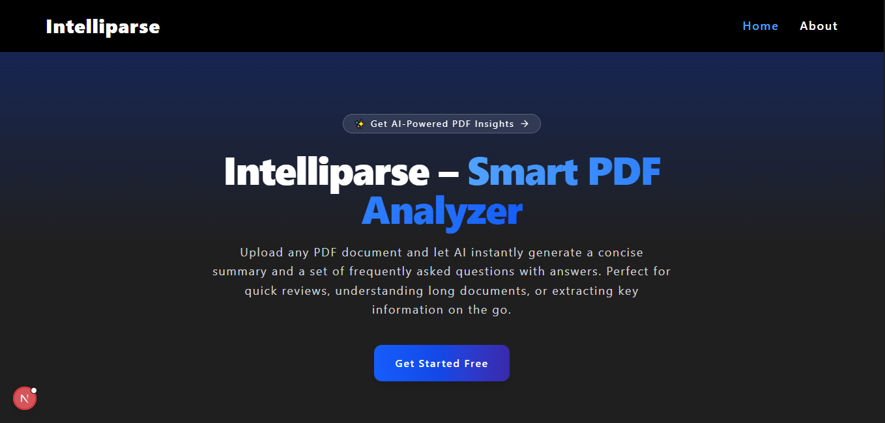
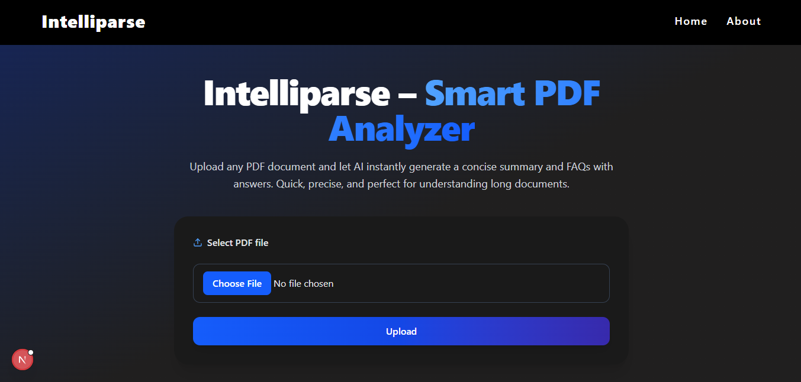
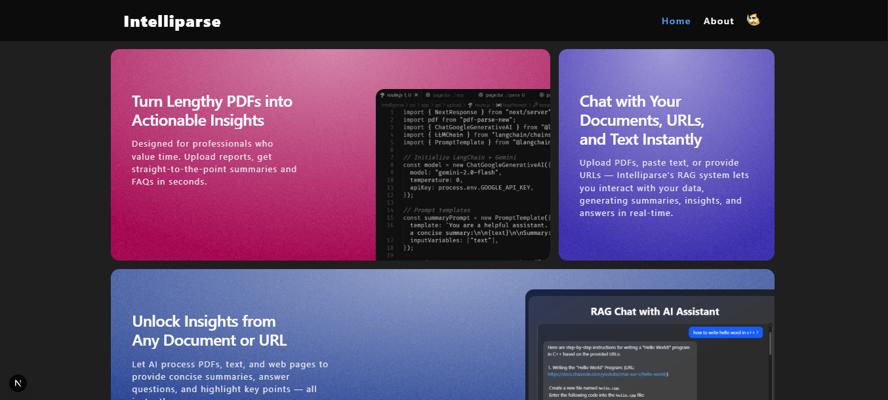
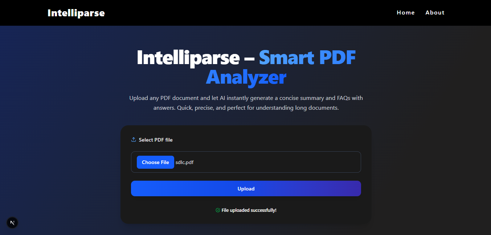
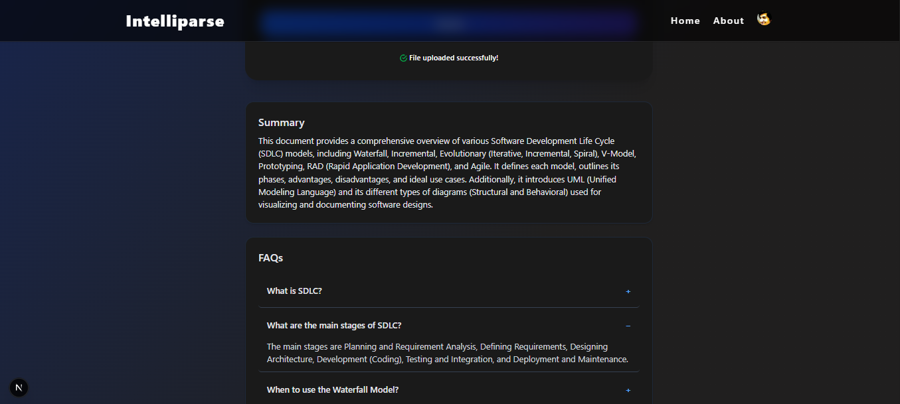

# 🚀 Intelliparse — AI-powered PDF Summarization & FAQ Generator

Intelliparse is a full-stack web application built with the **MERN** stack and powered by **LangChain** and **Google Gemini 2.0 Flash API**. It allows users to upload PDF files, receive intelligent document summaries, and auto-generate structured FAQs based on the content — making document analysis faster and smarter.

---

## 🔍 Features

- 📤 Upload and parse PDF documents
- ✨ Get AI-generated summaries instantly
- ❓ Auto-generate structured FAQs in JSON format
- 🔐 Secure authentication with JWT in HTTP-only cookies
- 🚫 Protected frontend and backend routes
- ✅ Error handling & form validations
- 🎨 Responsive and clean UI

---

## 🛠 Tech Stack

### Frontend
- [React.js](https://reactjs.org/)
- [TailwindCSS](https://tailwindcss.com/)
- [Aceternity UI](https://ui.aceternity.com/)
- [Sera UI](https://seraui.seraprogrammer.com/)
- [Axios](https://axios-http.com/)
- [React Router](https://reactrouter.com/)

### Backend
- [Node.js](https://nodejs.org/)
- [Express.js](https://expressjs.com/)
- [Multer](https://github.com/expressjs/multer) for file uploads
- [JWT](https://jwt.io/) for authentication
- [Bcrypt](https://github.com/kelektiv/node.bcrypt.js) for password hashing

### Database
- [MongoDB](https://www.mongodb.com/) with [Mongoose](https://mongoosejs.com/)

### AI Integration
- [LangChain](https://www.langchain.com/)
- [Google Gemini 2.0 Flash API](https://deepmind.google/technologies/gemini/)

---

## 🔐 Authentication Flow

- Signup/Login system using JWT stored in **HTTP-only cookies**
- Backend: Route protection using custom `authenticateUser` middleware
- Frontend: Routes restricted for unauthenticated users
- Navbar dynamically changes based on login status

---


## 📦 Installation

### 1. Clone the Repo

```bash
git clone https://github.com/icodervivek/intelliparse.git
cd intelliparse
```

### 2. Backend Setup

```bash
cd backend
npm install
```
Create a .env file:

```bash
PORT=your_port
MONGO_URI=your_mongodb_connection_string
SECRET=your_jwt_secret
GOOGLE_API_KEY=your_google_gemini_api_key
```
Start the backend server:

```bash
npm run dev
```
### 3. Frontend Setup

```bash
cd ../frontend
npm install
```
Create a .env file:

```bash
VITE_BACKEND_API=your_backend_api
```

Start the frontend:

```bash
npm run dev
```

---

## 🐳 Docker Deployment (with Compose)

### ⚙️ Prerequisites

- Docker
- Docker Compose
- MongoDB URI (local or Atlas)

### 📁 Directory Structure

```
intelliparse/
├── backend/
│   ├── Dockerfile
│   └── .env           # ✅ Needed to create manually
├── frontend/
│   ├── Dockerfile
│   └── .env           # ✅ Needed to create manually
├── docker-compose.yml
```

### 🧾 Step 1: Create .env Files

backend/.env

```
PORT=3000
MONGO_URI=your_mongodb_connection_string
SECRET=your_jwt_secret
GOOGLE_API_KEY=your_google_gemini_api_key
```

frontend/.env
```
VITE_BACKEND_API=http://localhost:3000  # or add the backend link
```

__Note 📝__   `.env` files are excluded from the build (via .dockerignore). So they must be created on the host system before running Compose.

## 🛠 Step 2: Run Docker Compose

From the root directory:

```
docker compose up --build -d
```

This will:

- 🐳 Build and start both containers
- 🔁 Mount .env into the containers at runtime
- 🔗 Set up an internal Docker network for service-to-service communication


### 🛑 Stopping the App

```
docker compose down
```


### 4. 📸 Demo




