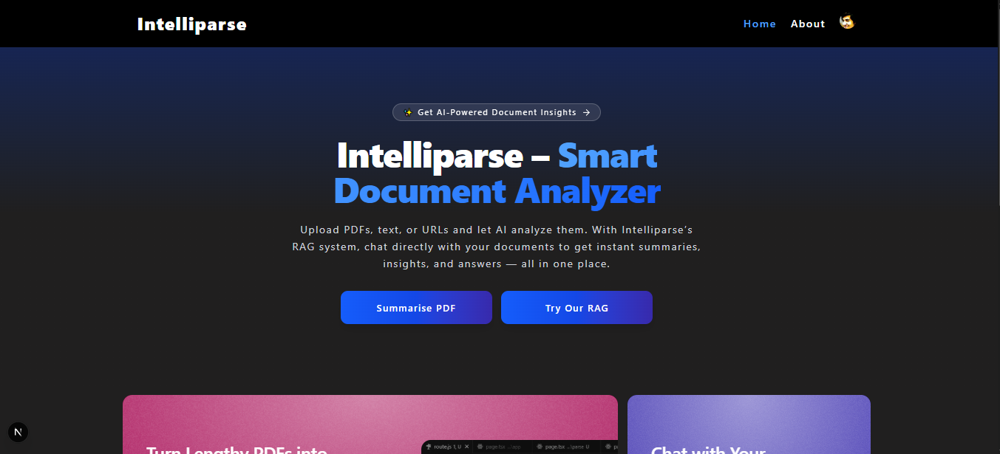

# Intelliparse – Smart PDF Analyzer & RAG Chat

**Intelliparse** is an AI-powered web application that allows users to upload PDF documents, extract knowledge, and interact with AI in a **RAG (Retrieval-Augmented Generation)** chat interface.  

It supports:  
- **Authentication via Clerk (Google login)**  
- **Vector storage and retrieval** using Qdrant  
- **Context-aware AI chat** leveraging uploaded PDFs, text, or URLs  

Perfect for students, professionals, and anyone who wants **fast, context-aware insights** from documents.

---

## 🚀 Features

- Upload PDFs, text, or URLs and generate **knowledge embeddings**  
- Generate **smart summaries** and **FAQs** from documents  
- **RAG chat interface** to ask questions based on uploaded sources  
- **Vector storage with Qdrant** for efficient retrieval  
- **Clerk authentication** with Google SSO  
- Interactive **FAQ / Chat UI** with code & link highlighting  
- Modern **UI with animations** and responsive design  

---

## 📸 Screenshots

**Home / Upload Page**  
  
  

**Summary & FAQs**  
  
  

**RAG Chat**  
  
  
  

---

## 🛠 Tech Stack

- **Frontend:** Next.js, React, TypeScript, TailwindCSS, Framer Motion  
- **Backend:** Next.js API routes, Axios  
- **Authentication:** Clerk (Google SSO)  
- **Vector DB:** Qdrant for storing and retrieving embeddings  
- **AI / Embeddings:** OpenAI, Google Generative AI, LangChain  
- **Syntax Highlighting:** Highlight.js  

---

## ⚡ Installation

1. **Clone the repository:**

```bash
git clone https://github.com/icodervivek/intelliparse.git
cd intelliparse
```

2. **Install dependencies:**

```bash
npm install
# or
yarn install
```

3. **Create a `.env` file** in the root:

```env
GOOGLE_API_KEY=your_google_generative_ai_key
QDRANT_URL=your_qdrant_host
QDRANT_API_KEY=your_qdrant_api_key
NEXT_PUBLIC_CLERK_PUBLISHABLE_KEY=clerk_publishable_key
CLERK_SECRET_KEY=your_secret_key
NEXT_PUBLIC_CLERK_SIGN_IN_URL=/sign-in
NEXT_PUBLIC_CLERK_SIGN_UP_URL=/sign-up
NEXT_PUBLIC_CLERK_AFTER_SIGN_IN_URL=/
NEXT_PUBLIC_CLERK_AFTER_SIGN_UP_URL=/
```

4. **Run the development server:**

```bash
npm run dev
# or
yarn dev
```

5. Open [http://localhost:3000](http://localhost:3000) in your browser.

---

## 💡 Usage

### Authentication
- Sign in using **Google via Clerk**.  
- Only authenticated users can upload documents or chat in the RAG feature.  

### Upload & Summarize PDF
1. Go to **Home / Summarise PDF**.  
2. Click **Select PDF** and upload your source.  
3. Click **Upload** to generate summaries, and FAQs.  

### RAG Chat
1. Navigate to the **Home / Try Our RAG**.  
2. Click on the **attachment icon** and upload PDFs, URLs or text from your source.  
2. Ask AI questions — it retrieves relevant context from uploaded PDFs, text, or URLs using **Qdrant embeddings**.  
3. Answers include **references to the source documents**.  

### Managing Contexts
- Clear uploaded sources and chat history using the **Clear Chat** button.  
- Vector embeddings are stored in **Qdrant** for faster retrieval.

---

## 🤝 Contributing

Contributions are welcome!  
- Open an issue to suggest features or report bugs.  
- Submit a pull request to add improvements.  

---

**Made with ❤️ by Vivek**