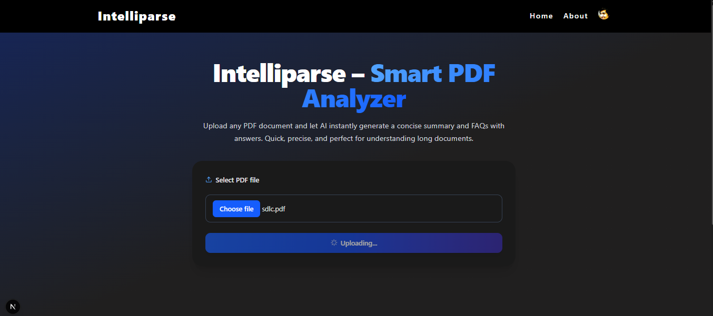

# 🚀 Intelliparse — AI-powered PDF Summarization & FAQ Generator

Intelliparse is a full-stack web application built with the **MERN** stack and powered by **LangChain** and **Google Gemini 2.0 Flash API**. It allows users to upload PDF files, receive intelligent document summaries, and auto-generate structured FAQs based on the content — making document analysis faster and smarter.

---

## 🔍 Features

- 📤 Upload and parse PDF documents
- ✨ Get AI-generated summaries instantly
- ❓ Auto-generate structured FAQs in JSON format
- 🔐 Secure authentication with JWT in HTTP-only cookies
- 🚫 Protected frontend and backend routes
- ✅ Error handling & form validations
- 🎨 Responsive and clean UI

---

## 🛠 Tech Stack

### Frontend
- [React.js](https://reactjs.org/)
- [TailwindCSS](https://tailwindcss.com/)
- [Axios](https://axios-http.com/)
- [React Router](https://reactrouter.com/)

### Backend
- [Node.js](https://nodejs.org/)
- [Express.js](https://expressjs.com/)
- [Multer](https://github.com/expressjs/multer) for file uploads
- [JWT](https://jwt.io/) for authentication
- [Bcrypt](https://github.com/kelektiv/node.bcrypt.js) for password hashing

### Database
- [MongoDB](https://www.mongodb.com/) with [Mongoose](https://mongoosejs.com/)

### AI Integration
- [LangChain](https://www.langchain.com/)
- [Google Gemini 2.0 Flash API](https://deepmind.google/technologies/gemini/)

---

## 🔐 Authentication Flow

- Signup/Login system using JWT stored in **HTTP-only cookies**
- Backend: Route protection using custom `authenticateUser` middleware
- Frontend: Routes restricted for unauthenticated users
- Navbar dynamically changes based on login status

---


---

## 📦 Installation

### 1. Clone the Repo

```bash
git clone https://github.com/icodervivek/intelliparse.git
cd intelliparse
```

### 2. Backend Setup

```bash
cd backend
npm install
```
Create a .env file:

```bash
PORT=your_port
MONGO_URI=your_mongodb_connection_string
SECRET=your_jwt_secret
GOOGLE_API_KEY=your_google_gemini_api_key
```
Start the backend server:

```bash
npm run dev
```
### 3. Frontend Setup

```bash
cd ../frontend
npm install
```
Start the frontend:

```bash
npm run dev
```

### 4. 📸 Demo


